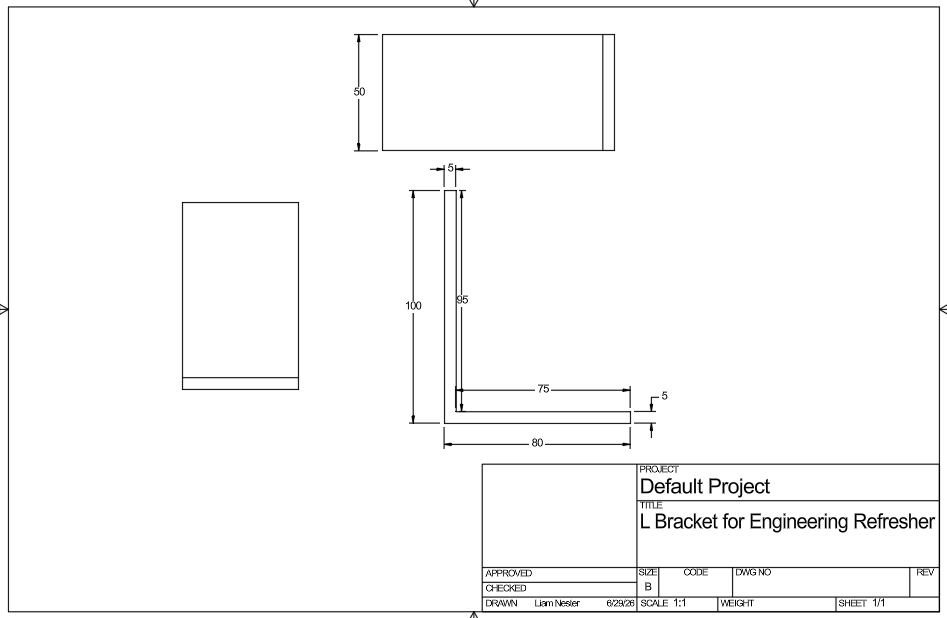
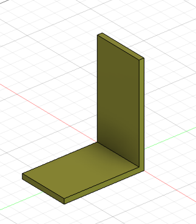
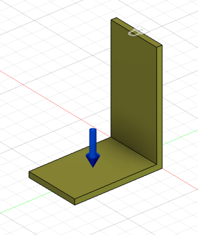
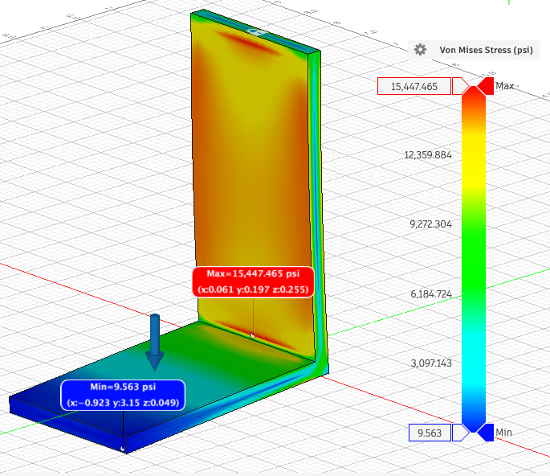
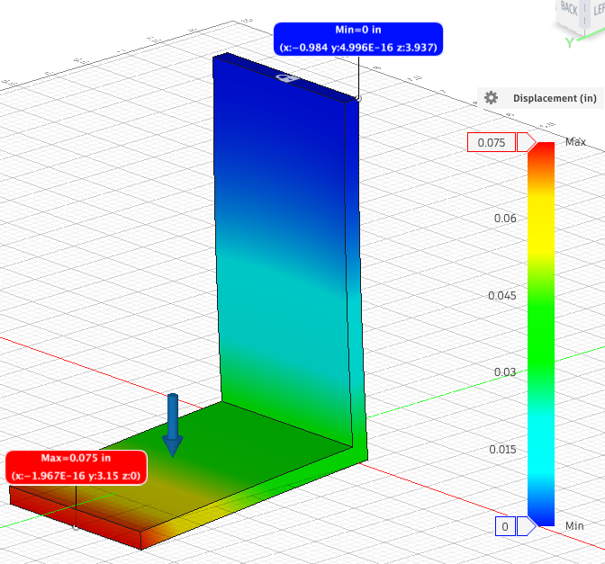
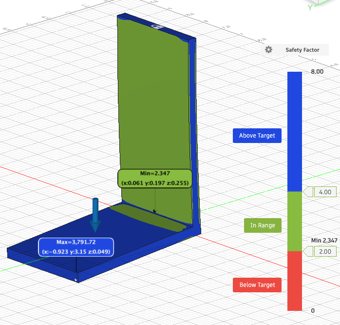
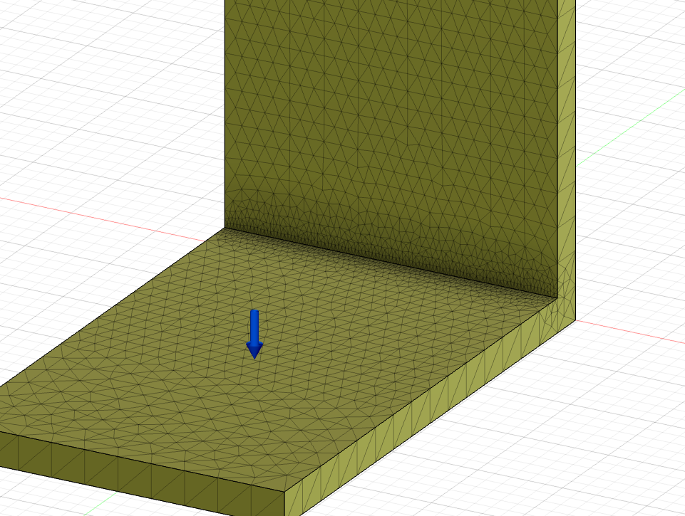
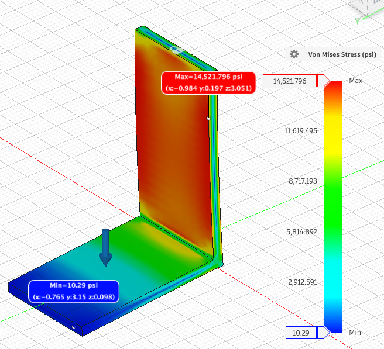
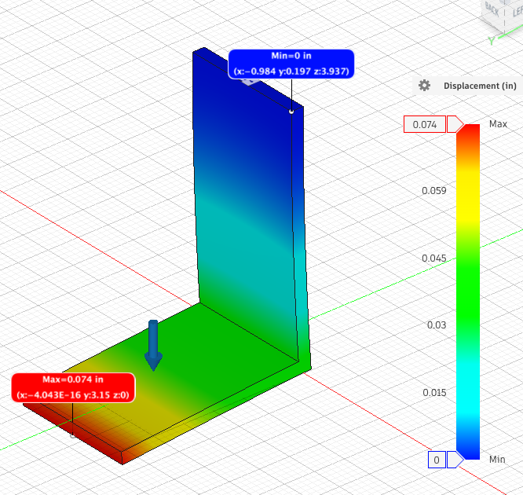
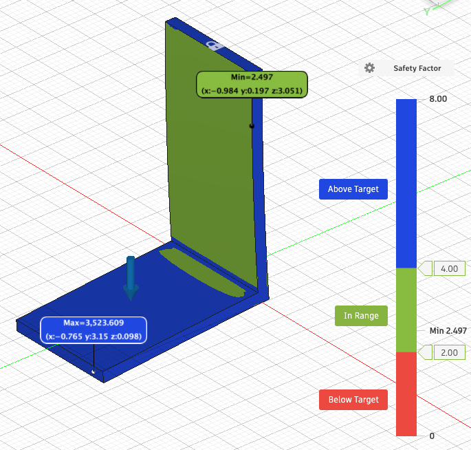

# M3 — FEA Structural Analysis
### L-Bracket Under Load: A Complete Worked Example

This document is a step-by-step walkthrough of a finite element analysis (FEA) on a steel L-bracket. It covers the full workflow — from CAD geometry to hand calculation validation — and is written to be used as both a personal reference and a teaching guide for students new to FEA.

---

## Table of Contents
1. [Background & Concepts](#background--concepts)
2. [Problem Setup](#problem-setup)
3. [Workflow Overview](#workflow-overview)
4. [Results — Default Mesh](#results--default-mesh)
5. [Results — Refined Mesh](#results--refined-mesh-interior-corner)
6. [Mesh Convergence Check](#mesh-convergence-check)
7. [Hand Calculation — Cantilever Beam](#hand-calculation--cantilever-beam)
8. [Design Adequacy Assessment](#design-adequacy-assessment)
9. [Key Takeaways](#key-takeaways)
10. [Notes & Observations](#notes--observations)
11. [Deliverable Checklist](#deliverable-checklist)

---

## Background & Concepts

### What is FEA?

Finite Element Analysis (FEA) is a numerical method for predicting how a physical structure will respond to loads, heat, vibration, or other conditions. Instead of solving the governing equations for an entire complex geometry — which is usually impossible analytically — FEA divides the structure into thousands of small, simple shapes called **elements**. The equations are solved for each element and the results are assembled to describe the behavior of the whole part.

**Why use FEA?**
- Real parts have complex shapes, holes, fillets, and boundary conditions that hand calculations can't capture well
- FEA gives full-field results — you can see stress everywhere, not just at one point
- It allows you to test design changes virtually before building anything

**When should you validate with a hand calculation?**
Always. FEA is only as good as the inputs (geometry, loads, material, boundary conditions) and the mesh. A hand calculation gives you a sanity check — if the FEA result is wildly different from the hand calc without a good reason, something is wrong with your model.

---

### Key Quantities

**Von Mises Stress** is the standard way to predict yielding in ductile metals under complex loading. Even when stress acts in multiple directions simultaneously, von Mises combines them into a single equivalent stress that can be compared directly to the material's yield strength from a simple tension test.

> A part yields when: σ_vonMises ≥ σ_yield

**Factor of Safety (FOS)** measures how much margin exists between the actual stress and the failure point:

> FOS = σ_yield / σ_peak

A FOS of 1.0 means the part is right at the edge of yielding. A FOS of 2.0 means the actual stress is half the yield strength — common for static structural applications.

**Stress Concentration** occurs at geometric discontinuities — corners, holes, notches, fillets. Stress "piles up" at these locations because the load path is forced to change direction abruptly. The interior corner of an L-bracket is a classic stress concentration site. This is why FEA (which captures geometry) will always show higher peak stress at corners than a simple beam formula.

**Mesh Convergence** is the process of verifying that your FEA result is independent of mesh density. A coarser mesh approximates the geometry less accurately and tends to underpredict peak stress at concentration sites. As you refine the mesh, the result should converge toward a stable value. If two mesh densities give results within ~5–10% of each other, the solution is considered converged.

---

## Problem Setup

### Engineering Drawing



**All dimensions verified against spec:**

| Feature | Dimension |
|---|---|
| Vertical leg height (outer) | 100 mm |
| Vertical leg interior | 95 mm |
| Horizontal leg length (outer) | 80 mm |
| Horizontal leg interior | 75 mm |
| Wall thickness (both legs) | 5 mm |
| Depth (into page) | 50 mm |

### CAD Model



### Geometry
L-bracket cross-section: 100 mm vertical leg × 80 mm horizontal leg, 5 mm uniform wall thickness, 50 mm depth.

### Load Case
- **Load:** 500 N downward distributed load applied to the free (bottom) face of the horizontal leg
- **Constraint:** Fixed in all directions on the top face of the vertical leg (simulates the bracket bolted to a wall)



> **Teaching note:** A distributed load spreads the force evenly across the face. This is more realistic than a point force at a single node, which would create an artificially high local stress at that point.

### Material
- **Material:** Structural steel (AISI 1020 or equivalent)
- **Young's Modulus:** E = 200 GPa (stiffness — how much it deflects under load)
- **Poisson's Ratio:** ν = 0.30 (how much it contracts laterally when stretched longitudinally)
- **Yield Strength:** σ_yield = 250 MPa (stress at which permanent deformation begins)

---

## Workflow Overview

Follow these steps in order. Screenshot every major step — the screenshots are part of the deliverable.

1. **Model** the L-bracket in Fusion 360 per the drawing above
2. **Set up** the simulation: apply material, boundary conditions, and load
3. **Run** the static stress analysis with the default mesh
4. **Record** peak von Mises stress (location + magnitude), max displacement, and FOS
5. **Refine** the mesh at the interior corner and re-run
6. **Compute** percent change in peak stress between mesh densities (convergence check)
7. **Hand calculate** bending stress treating the horizontal leg as a cantilever beam
8. **Compare** hand calc to FEA and explain the discrepancy
9. **Assess** whether the design meets the FOS ≥ 2.0 requirement

---

## Results — Default Mesh

### What to look for
Before interpreting results, predict qualitatively:
- Where should stress be highest? At the interior corner — that's where the bending moment is maximum and the geometry changes abruptly.
- Where should displacement be highest? At the free end of the horizontal leg — it's a cantilever, so the tip deflects the most.
- Is the color map what you expected?



| Parameter | Value |
|---|---|
| Peak von Mises Stress | 15,447.465 psi / **106.5 MPa** |
| Location of Peak Stress | Interior corner — stress concentration at the bend |
| Minimum von Mises Stress | 9.563 psi |
| Maximum Displacement | 0.075 in / **1.905 mm** |
| Location of Max Displacement | Free end of horizontal leg |
| Factor of Safety | **2.347** ✅ |

> **Discussion:** The peak stress is at the interior corner — exactly where the geometry change forces all the load path to turn the corner. The displacement peaks at the free tip, consistent with a cantilever. Both results match physical intuition before we even look at numbers.





---

## Results — Refined Mesh (Interior Corner)

### Why refine at the corner?
The default mesh uses elements of roughly uniform size across the whole part. At the interior corner, the stress gradient is steep — stress changes rapidly over a very short distance. Coarse elements can't resolve this gradient accurately, so they tend to underestimate peak stress. Refining the mesh specifically at the corner puts more elements where the math is hardest, without wasting computation on regions where the stress is nearly uniform.





| Parameter | Value |
|---|---|
| Peak von Mises Stress | 14,521.796 psi / **100.1 MPa** |
| Location of Peak Stress | Interior corner (same location as default mesh) |
| Minimum von Mises Stress | 10.29 psi |
| Maximum Displacement | 0.074 in / **1.880 mm** |
| Factor of Safety | **2.497** ✅ |
| % Change in Peak Stress from Default | **-6.0%** (15,447 → 14,522 psi) |
| % Change in Displacement from Default | -1.3% (0.075 → 0.074 in) — negligible |

> **Discussion:** Interestingly, the refined mesh gave a *lower* peak stress than the default mesh, not higher. This is because the coarser mesh was actually overestimating the stress concentration — the sharp corner in the coarse mesh was acting like a true mathematical singularity, whereas the refined mesh better represents the actual geometry (which has some finite radius at the corner). Displacement barely changed because it is a global, integrated quantity — much less sensitive to local mesh density than peak stress.





---

## Mesh Convergence Check

**Rule of thumb:** if the peak stress changes by less than 5–10% between two mesh densities, the solution is considered converged and further refinement is not necessary.

| Mesh | Peak Stress (MPa) | Max Displacement (in) | FOS |
|---|---|---|---|
| Default | 106.5 | 0.075 | 2.347 |
| Refined (corner) | 100.1 | 0.074 | 2.497 |
| % Change | **-6.0%** | -1.3% | +6.4% |

**Conclusion:** The 6.0% change in peak stress sits right at the convergence threshold. The solution is approaching convergence. For a more rigorous analysis, a second level of refinement could be run to confirm the trend is flattening. For this exercise, the refined mesh result is accepted as sufficiently converged.

> **Key insight:** Displacement converges much faster than stress. This is why deflection-based analyses (e.g., checking stiffness) need less mesh refinement than stress-based analyses (e.g., checking yield or fatigue).

---

## Hand Calculation — Cantilever Beam

### Concept
Before running FEA, engineers always estimate the answer with a simplified hand calculation. This tells you:
1. The right order of magnitude for the result
2. Whether to trust your FEA output (if they're off by 10×, something is wrong)
3. A conservative bound for quick design decisions

**Model:** Treat the horizontal leg as a cantilever beam — fixed at the wall (the corner), free at the tip, with a point load F at the tip.

```
        F = 500 N
        ↓
────────┘
   L = 80 mm
```

The maximum bending moment occurs at the fixed end (the corner) — this is where the beam "wants to break."

### Formulas

**Bending Moment** at the fixed end:

> M = F × L

**Second Moment of Area** for a rectangular cross-section:

> I = bh³ / 12

where b = width (depth into page = 50 mm) and h = height in the bending direction (wall thickness = 5 mm).

**Distance from neutral axis to outer fiber:**

> c = h / 2

**Maximum bending stress** (flexure formula):

> σ = Mc / I

### Calculation

| Step | Formula | Result |
|---|---|---|
| Bending Moment | M = 500 × 80 | **40,000 N·mm** |
| Moment of Inertia | I = (50 × 5³) / 12 | **520.83 mm⁴** |
| Neutral Axis Distance | c = 5 / 2 | **2.5 mm** |
| Bending Stress | σ = (40,000 × 2.5) / 520.83 | **192.0 MPa** |
| Factor of Safety | FOS = 250 / 192.0 | **1.302** ❌ |

See `M3Calcs.py` for the Python implementation of this calculation.

### Comparison to FEA

| | Hand Calc | FEA (Default) | FEA (Refined) |
|---|---|---|---|
| Peak Stress (MPa) | 192.0 | 106.5 | 100.1 |
| % Difference from Hand Calc | — | -44.5% | -47.9% |

### Why is the hand calc ~90% higher than FEA?

This is expected — and important to understand. The hand calc is conservative by design:

| Source of Discrepancy | Explanation |
|---|---|
| **Load assumption** | Hand calc treats the 500 N as a point force at the tip. FEA distributes it uniformly across the face, which reduces the peak moment arm slightly. |
| **Section assumption** | Hand calc uses only h = 5 mm (wall thickness) as the bending dimension. The actual cross-section has 50 mm of depth, which contributes enormous stiffness — I scales with h³, so even a small increase in the bending dimension drastically reduces stress. |
| **Boundary conditions** | The fixed wall in FEA provides rotational stiffness at the base that a simple cantilever doesn't model. |
| **3D stress redistribution** | FEA captures how stress spreads through the full 3D geometry. The hand calc is a 1D beam model. |

> **Teaching note:** The hand calc giving a *higher* stress than FEA is the correct direction — it should be conservative. If your hand calc gave a lower stress than FEA, that would be a red flag that something in your model is wrong.

---

## Design Adequacy Assessment

### Factor of Safety Summary

| Method | Peak Stress (MPa) | FOS | Meets FOS ≥ 2.0? |
|---|---|---|---|
| Hand Calculation | 192.0 | 1.302 | ❌ No |
| FEA — Default Mesh | 106.5 | 2.347 | ✅ Yes |
| FEA — Refined Mesh | 100.1 | 2.497 | ✅ Yes |

### Interpretation

The hand calculation predicts a FOS of 1.302 — below the 2.0 threshold. However, the hand calc is a deliberately conservative simplification. The FEA, which models the actual 3D geometry, distributed load, and boundary conditions, gives FOS = 2.347–2.497 across both mesh densities.

**Design verdict: the bracket passes.** FEA is the authoritative result here. The hand calc is useful as a sanity check and conservative upper bound, but design decisions should be based on the higher-fidelity FEA.

> **If the FEA had also failed (FOS < 2.0):** The most effective dimension to change is the wall thickness h. Because I = bh³/12, doubling h from 5 mm to 10 mm would increase I by a factor of 8, reducing bending stress by 8× — far more effective than increasing any other dimension.

### Stress Concentration at the Interior Corner

The peak stress occurs at the interior corner in both mesh runs. In a real design, this would be addressed by adding a **fillet radius** at the corner. A fillet smooths the load path, reducing the stress concentration factor Kt and spreading the peak stress over a larger area. Even a small radius (1–2 mm) can reduce peak stress by 20–40% at a sharp interior corner.

---

## Key Takeaways

### Physics
- Bending moment is maximum at the fixed support — that's always where a cantilever is most likely to fail
- Stress concentrations at geometric discontinuities (corners, holes, notches) are where failures initiate in real parts
- FOS = yield strength / peak stress; a value ≥ 2.0 provides adequate margin for static loading

### FEA Methodology
- Always run at least two mesh densities and compare — mesh convergence is not optional
- Refine the mesh where stress gradients are steepest (corners, holes, transitions), not uniformly
- Displacement converges faster than stress — deflection checks need less refinement than yield checks
- A hand calculation should always precede FEA to set expectations and catch modeling errors

### Hand Calc vs. FEA
- Hand calcs are conservative by design — they bound the problem from above
- FEA is more accurate but requires correct inputs: wrong boundary conditions or loads give wrong answers
- The two methods should bracket the true answer — hand calc high, FEA lower and more accurate

### Extension Questions
1. What would happen to peak stress if you added a 2 mm fillet radius at the interior corner? Estimate qualitatively, then test in FEA.
2. The load here is static (constant). How would the analysis change for a cyclic load (fatigue)? Would a FOS of 2.0 still be sufficient?
3. If the bracket material were aluminum (E = 70 GPa, σ_yield = 270 MPa) instead of steel, how would the stress and displacement change?
4. The hand calc used h = 5 mm (wall thickness) as the bending height. What if you used b = 50 mm (depth) instead — would that be physically meaningful? Why or why not?

---

## Notes & Observations

- Peak stress location was consistent between default and refined mesh runs (interior corner, same coordinates) — confirms the result is real and not a mesh artifact
- Refined mesh gave lower peak stress than default (6.0% decrease) — the coarse mesh was slightly overestimating the stress concentration at the sharp corner
- Displacement result was essentially unchanged between mesh densities (1.3% change) — confirms displacement is a well-converged quantity even with the default mesh
- Hand calc FOS of 1.302 does not meet the 2.0 threshold, but this is expected given the conservatism of the simplified cantilever model
- FEA FOS of 2.347–2.497 passes the threshold with margin; the design is adequate as modeled

---

## Deliverable Checklist

- [x] L-bracket modeled per spec
- [x] Load case applied (500 N distributed, fixed top face)
- [x] Default mesh run — stress, displacement, FOS recorded
- [x] Refined mesh run — mesh convergence check computed
- [x] Hand calculation completed (`M3Calcs.py`)
- [x] FEA vs. hand calc comparison written
- [x] Design adequacy assessed
- [x] Screenshots attached
- [ ] Pushed to GitHub
